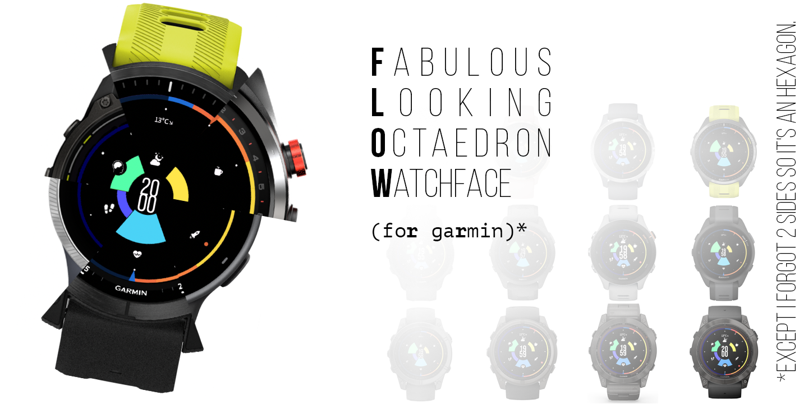

# FLOWr
_Fabulous Looking Octaedron Watchface (for garmin)*_

*except I forgot 2 sides so it's an hexagon.

## Overview

> 10 metrics to choose from, 6 fields to display them and inside a day&night ring bind them. 
>With the current time in the middle, it's a watchface after all.

## Features

6 data zones to fill with your specified metrics
Custom icons
Legible time font
Carefully selected colors
All-around ring displaying daily sunrise, sunset and current sun position at your location

### Metrics

- Weather indicator
- Move Bar
- Heart Rate
- Stress lvl
- Daily steps
- Daily actives minutes
- Respiration rate
- Body battery
- Watch battery
- Daily distance
- Daily calories

## Settings

- top | bottom gauge metric or weather indicator
- top & bottom left|right gauges metric
- temperature units

## Compatibility

Most round Garmin watches with API lvl ~3.3.0

## Like it?

Buy me a coffee 👉 👉 👉 [https://www.buymeacoffee.com/assets/img/custom_images/orange_img.png](https://bmc.link/vroger)
